# Level authoring

Levels are authored as TypeScript recipes in `tools/levels/recipes.ts`. The browser only loads the checked-in catalog; generation and solving never run during play.

```mermaid
flowchart LR
    Recipe[TypeScript recipe] -->|compile board| Candidate[Seeded stack candidates]
    Candidate -->|shared simulation| Solver[Finite solver]
    Solver -->|winning witness| Timing[Timing and jitter validation]
    Timing -->|hard constraints pass| Score[Difficulty v2]
    Score -->|target and tolerance| Catalog[Generated static catalog]
    Catalog -->|import| Game[Phaser game]
```



## Commands

| Command | Purpose |
|---|---|
| `npm run levels:generate` | Generate all recipes and overwrite the catalog. |
| `npm run levels:generate -- --recipe sunflower` | Check the requested ID, then deterministically rebuild the catalog. |
| `npm run levels:validate` | Regenerate in memory and fail if the committed catalog is stale. |
| `npm run levels:report` | Print ordinal, ID, score, peak buffer occupancy, and full-buffer requirement. |

Failures exit non-zero. Diagnostics include the recipe ID, attempted candidates, closest score, and rejection reasons such as `unsolvable`, `solver-budget-exceeded`, `human-timing`, or `difficulty-outside-target`.

`src/levels/generated/catalog.generated.ts` is generated output. Do not edit it manually. Commit recipe and generated-file changes together.

## Complete ASCII example

```ts
import type { LevelRecipe } from '../../src/level-tools/types';

export const sunflower: LevelRecipe = {
  id: 'sunflower',
  title: 'Sunflower',
  board: {
    kind: 'ascii',
    rows: [
      '..PPP..',
      '.POOOP.',
      'POOOOOP',
      'POOBOOP',
      'POOOOOP',
      '.POOOP.',
      '..G.G..',
    ],
    symbols: { B: 'blue', G: 'green', O: 'orange', P: 'pink' },
  },
  seed: 108,
  targetDifficulty: 28,
  difficultyTolerance: 2,
  requiresFullBuffer: false,
  generationBudget: {
    maxCandidates: 4,
    maxVisitedStates: 250_000,
    maxElapsedMs: 12_000,
  },
  speedTrackUnitsPerSecond: 30,
};
```

Use `.` for an empty cell. Every other character must exist in `symbols`. Rows must have equal width. A programmed board uses `{ kind: 'programmed', build: () => BoardDefinition }`; the compiler calls `build` twice and rejects nondeterministic output.

Optional controls:

- `containerCounts`: exact container count per color.
- `stackColors`: exact color order in four stacks; ammunition partitions remain seeded.
- `requiresFullBuffer`: require a robust win that reaches all five buffer slots.
- `fullBufferCertificate`: structural timing proof for the supported blocked-prefix pattern.

All pixel counts must equal total ammunition of the corresponding color. The generator enforces this invariant and emits exactly four stacks.

## Solvability and human timing

The solver reuses `GameSimulation`, advances in 50 ms quanta, and has explicit state and elapsed-time budgets. Generation accepts only a saved winning witness.

Every accepted witness is replayed under a human timing contract:

- at least 300 ms between inputs;
- nominal schedule;
- all inputs shifted 150 ms early and late;
- alternating early/late shifts;
- every individual input shifted by −150 ms and +150 ms.

The pipeline may add deterministic spacing to an earliest solver witness, then reruns the complete suite. A failed perturbation rejects the candidate.

### Required full buffer

The general four-slot exhaustive check remains available for small recipes. Production vault levels use a narrower proof certificate whose assumptions are mechanically checked:

1. Five same-color containers form the prefix of the only non-empty stack.
2. A unique gate-color container follows them.
3. The gate color is the first occupied pixel on every ray containing the blocked color.
4. One track lap is no longer than the 300 ms minimum input interval.
5. The saved robust witness wins and reaches five occupied buffer slots.

Because each blocked container must return before another legal input, relaunching cannot reduce occupancy; the fifth prefix container therefore requires the fifth slot before the gate can be launched. This proof applies only to that declared pattern. Other layouts must use exhaustive capped search or add a separately reviewed certificate kind.

## Difficulty score

Difficulty configuration version `2` produces an integer from 0 to 100. Each raw component is clamped to `[0, 1]`, weighted, summed, and rounded once.

| Component | Weight | Current signal |
|---|---:|---|
| Order dependency | 35 | Relaunches relative to container count. |
| Buffer pressure | 33 | Peak occupied slots divided by five. |
| Decision branching | 15 | Search alternatives and dead ends. |
| Timing pressure | 7 | Peak simultaneous active containers. |
| Normalized length | 10 | Actions and elapsed seconds relative to pixels plus containers. |

Tune `targetDifficulty` and `difficultyTolerance`; do not add per-level score overrides. Coefficient changes require a new version, catalog regeneration, and review of `npm run levels:report` output. Board size influences normalized length but does not determine the score alone.

## Authoring loop

1. Add an ASCII or programmed recipe with a stable ID and seed.
2. Set a target and narrow tolerance.
3. Run `npm run levels:generate -- --recipe <id>` and inspect failures.
4. Tune the board, seed, container counts, stack template, or global versioned coefficients.
5. Run `npm run levels:generate`, `npm run levels:validate`, and `npm run levels:report`.
6. Commit the recipe and generated catalog together.

The current catalog contract requires four levels in each band: 15–30, 35–60, and 65–85; at least three hard levels must prove required full-buffer occupancy.
