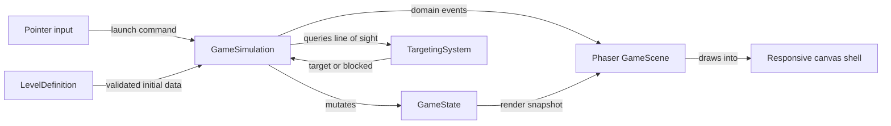
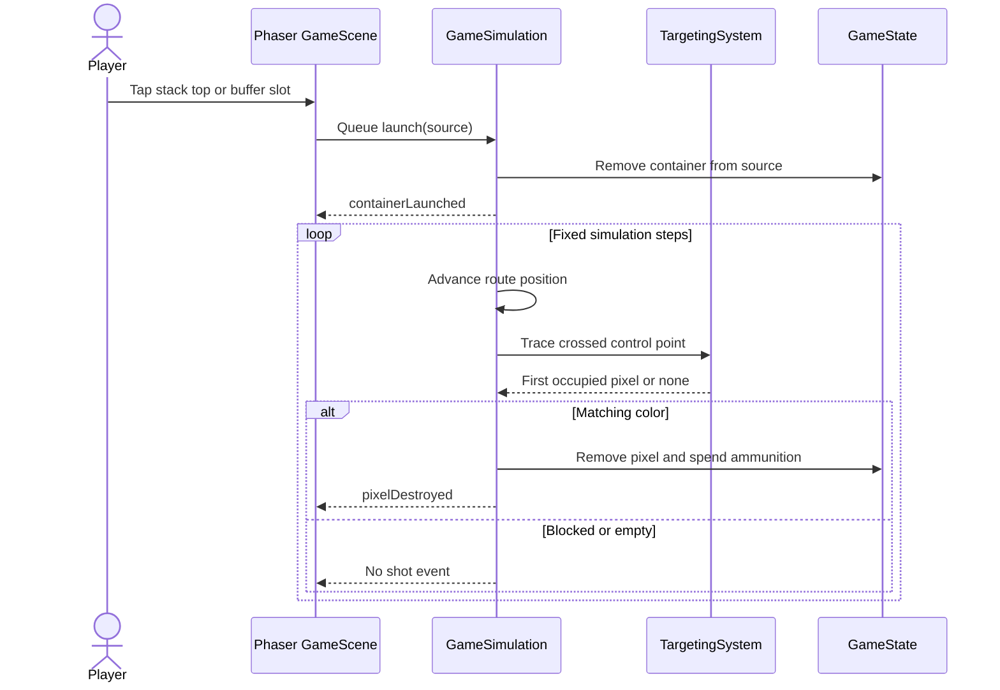

# Pixel Flow MVP Design

**Status:** Approved in brainstorming; pending written-spec review

**Date:** 2026-09-02

## Purpose

Build a mobile-first real-time puzzle prototype playable from a browser and deployable to GitHub Pages. The prototype validates one core loop: launch colored containers from visible stacks, clear matching exposed pixels, and manage returned containers in a five-slot buffer.

## MVP Scope

The MVP contains:

- one handcrafted level;
- one portrait layout used on mobile and desktop;
- a colored pixel grid surrounded by a conveyor;
- four fully visible container stacks;
- five reusable buffer slots;
- concurrent container movement;
- win, danger, loss, pause, resume, and restart states.

The MVP excludes hidden stack contents, keys, durable pixels, boosters, currency, level selection, progression, persistence, PWA installation, and native packaging.

## Platform and Stack

- Phaser 3 for rendering, input, animation, timing, and asset loading;
- TypeScript for game rules and level definitions;
- Vite for local development and static production builds;
- Vitest for deterministic game-core tests;
- GitHub Actions and GitHub Pages for deployment.

React, Vue, a backend, and a physics engine are unnecessary. The page contains one Phaser canvas inside a small responsive shell.

Phaser is preferred over PixiJS because it supplies game-loop and scene primitives in addition to rendering. Godot is deferred because its browser export adds WebAssembly and mobile-web complexity that the prototype does not need. If store distribution becomes necessary, the web build can later be wrapped with Capacitor before considering a rewrite.

## Core Rules

### Board

The board is a rectangular grid. Each occupied cell contains one destructible pixel with a color. Empty cells do not block a shot.

### Sources

The level has four ordered stack positions. The player can launch only the top container of a stack. Every container in every stack remains visible. When a launch empties a stack, the remaining non-empty stacks compact left in their existing order, leaving empty positions on the right.

A returned container occupies one of five buffer slots. The player may relaunch any occupied buffer slot at any time. Launching immediately frees its source stack position or buffer slot.

### Containers

Each container has:

- a color;
- remaining ammunition;
- a position on the conveyor;
- a monotonically increasing launch ID.

All launched containers move concurrently, at the same fixed speed, around one closed route. Containers neither collide nor overtake; their visuals may share nearby route positions without affecting the rules.

One destroyed ordinary pixel consumes one ammunition unit. Unused ammunition persists between laps. A container disappears immediately when its ammunition reaches zero.

### Targeting

The conveyor has control points aligned with every board row and column. When a container crosses a control point:

1. Trace inward along that row or column.
2. Ignore empty cells.
3. Stop at the first occupied cell.
4. Destroy it and spend one ammunition if its color matches the container.
5. Do nothing if its color differs.

A container gets at most one shot at each control point during a lap. Other pixels therefore block matching pixels behind them.

### Lap Completion and Buffer

At the end of a lap:

- a container with zero ammunition is already gone;
- a container with ammunition enters the first available buffer slot;
- filling the fifth slot enters the danger state and highlights the buffer red;
- a further container attempting to return while all five slots remain occupied causes immediate loss.

Five occupied slots alone are not a loss. The player can relaunch any buffered container to leave the danger state before another return.

### Outcomes

- **Win:** the last board pixel is destroyed.
- **Loss:** a live container completes a lap while all five buffer slots are occupied.

Either outcome stops the simulation and presents a restart action.

## Runtime Semantics

The game core advances with a fixed simulation step independent of render frame rate. Commands received between steps are queued for the next step.

When multiple containers cross control points on the same step, process them by ascending launch ID. Each result updates the board before the next container is processed. This deterministic tie-breaker makes replays and tests stable.

Visual animations consume domain events but never decide game outcomes. Slow or dropped animation frames cannot change targeting, ammunition, or buffer state.

## Architecture

### Components

| Component | Responsibility | Dependencies |
|---|---|---|
| `LevelDefinition` | Declarative board, stacks, ammunition, and tuning | None |
| `LevelValidator` | Reject malformed or unsupported level data | `LevelDefinition` |
| `GameState` | Board, stacks, buffer, active containers, phase | Domain types only |
| `GameSimulation` | Fixed-step movement, commands, lap completion, outcomes | `GameState`, `TargetingSystem` |
| `TargetingSystem` | Find the first occupied cell on an inward ray | Board read interface |
| `GameScene` | Input binding, visual objects, effects, and event playback | Phaser, core facade |
| `ResponsiveShell` | Viewport sizing, safe areas, scroll/gesture suppression | Browser CSS and events |

The game core must not import Phaser or browser APIs.

## Launch-to-Hit Flow

## Level Data

A level definition contains:

- board width and height;
- occupied cells with coordinates and color IDs;
- exactly four ordered container stacks;
- color ID and positive ammunition for every container;
- route speed and simulation-safe tuning values.

The validator rejects duplicate coordinates, out-of-range cells, unknown colors, incorrect stack count, non-positive ammunition, and invalid timing values. Validation errors identify the offending field and prevent the scene from starting.

This schema is deliberately extensible. Later versions may add optional pixel durability, hidden stack entries, locks, keys, or per-level buffer capacity without coupling them to rendering.

## Screen and Input Design

The game uses one centered portrait surface. Wide screens show neutral side margins rather than a rearranged desktop interface.

From top to bottom:

1. compact level/status header;
2. board and surrounding conveyor;
3. separate five-slot buffer strip;
4. four fully visible stacks.

The separation is primarily an input-safety decision. A wrong launch is costly and frustrating, so every actionable source has a large, non-overlapping hit area.

Input requirements:

- at least `48 × 48` CSS pixels per actionable target;
- the entire slot or stack-top cell is interactive, not only its artwork;
- visible spacing between adjacent hit areas;
- immediate pressed feedback;
- no artificial launch delay;
- empty-source and stale duplicate commands are ignored safely.

The document and canvas use the dynamic viewport height, safe-area insets, hidden overflow, disabled overscroll, and disabled browser touch gestures over the game surface. Native browser chrome may remain visible; true fullscreen is not an MVP requirement.

## Session Lifecycle

The initial screen shows the prepared level and a **Start** action. The simulation begins only after explicit input.

When the document becomes hidden, the simulation pauses immediately. Returning to the tab shows a **Continue** action; elapsed background time is never simulated. Win and loss overlays expose **Restart**, which reconstructs state from the immutable level definition.

## Domain Events

The core emits data-only events:

- `containerLaunched`;
- `pixelDestroyed`;
- `containerDepleted`;
- `containerBuffered`;
- `dangerEntered` and `dangerExited`;
- `gamePaused` and `gameResumed`;
- `gameWon` and `gameLost`.

Rendering may skip or shorten cosmetic events under load, but it must preserve the latest state snapshot.

## Visual Direction

Use original geometric graphics rather than copying the reference game's assets. The MVP needs clear colors, pixel blocks, container ammunition labels, projectile traces, destruction feedback, buffer danger feedback, and distinct pressed states. Visual polish must not reduce color readability or hit-target size.

## Error Handling

- Invalid level data produces a readable development error and does not enter play.
- Commands targeting an empty or already-launched source are ignored.
- A resize recomputes display scale without resetting simulation state.
- A missing cosmetic asset falls back to a geometric placeholder where possible.
- An unrecoverable scene error stops the loop and exposes Restart instead of continuing with corrupt state.

## Verification

### Unit Tests

- rays skip empty cells and stop at the first occupied cell;
- mismatched pixels block matching pixels behind them;
- one control point produces at most one destroyed pixel per lap;
- ammunition decrements and persists correctly;
- zero-ammunition containers disappear;
- the fifth buffered container enters danger without losing;
- a sixth returning container loses when all slots remain occupied;
- relaunching from any buffer slot frees that slot;
- last-pixel destruction wins;
- simultaneous crossings resolve by launch ID;
- fixed-step results are identical under different render-frame timings.

### Integration and Manual Checks

- pointer input launches only the intended stack or buffer item;
- pause/resume ignores background elapsed time;
- restart recreates the exact initial level;
- no page scroll, pull-to-refresh, or canvas gesture interruption occurs;
- portrait layout remains usable at representative small and large mobile viewports;
- smoke-test current Safari on iPhone and Chrome on Android before publishing.

## Acceptance Criteria

- A player can complete or lose one handcrafted level entirely by tapping/clicking.
- Multiple containers can travel and shoot concurrently.
- Targeting follows the first-occupied-pixel blocking rule.
- Buffer danger and overflow loss behave deterministically.
- The game remains usable without page scrolling on a phone.
- The same production build runs from GitHub Pages and a local static preview.
- Core mechanics pass deterministic automated tests.

## Deferred Extensions

The design permits, but does not implement:

- additional level definitions and level selection;
- hidden stack contents;
- keys and locks;
- multi-hit pixels;
- boosters and alternative buffer capacities;
- saved progression and PWA installation;
- Capacitor-based native packaging.

These are separate product decisions after the one-level loop is validated.
