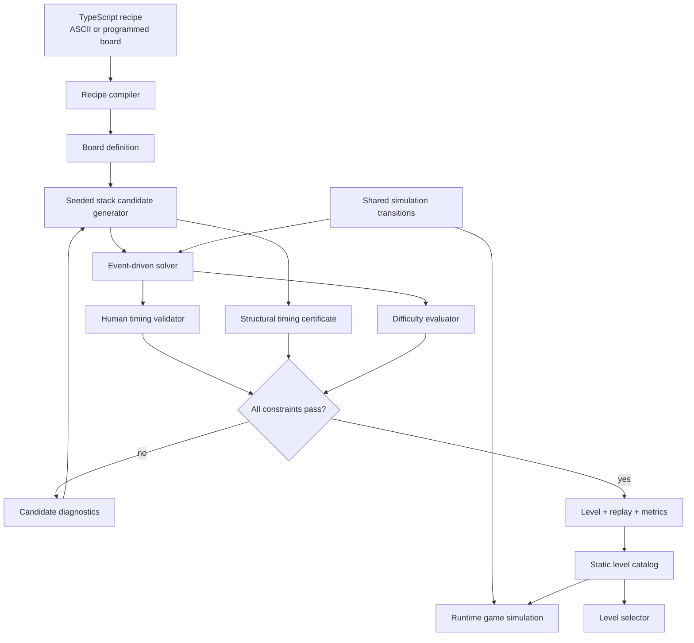

# Level Generation Tooling Design

**Status:** Implemented

**Date:** 2026-09-03

## Feature Brief

### Problem Statement

Pixel Flow needs a repeatable way to author more than one level without relying on manual playtesting to establish solvability. Level authors need to control visual composition and target difficulty while ensuring that every published level has a human-executable winning solution.

### Scope

#### In Scope

- A model-friendly TypeScript recipe format supporting ASCII art and programmed board generation.
- Deterministic stack generation from a recipe and seed.
- Automated solvability search using the production game rules.
- A numeric difficulty score normalized for board and solution size.
- Human-timing validation with minimum input spacing and jitter.
- An optional constraint requiring every winning solution to fill all five buffer slots.
- Checked-in generated levels, witness replays, metrics, and a runtime catalog.
- Twelve trial levels spanning easy, medium, and hard difficulty.
- An unlocked level selector, shareable level URL, and post-win navigation.
- CI validation of every catalog entry.
- Documentation for authoring, generating, validating, and tuning levels.

#### Out of Scope

- Runtime or server-side procedural generation.
- Natural-language or image-model integration inside the application; an agent authors recipes in source control.
- Progression gates, completion history, accounts, or persistent storage.
- Automatic proof that every arbitrary real-valued input timing succeeds.
- New gameplay mechanics, colors, boosters, locks, keys, or durable pixels.
- Automatic calibration from player analytics in this iteration.

### Acceptance Criteria

- [x] A recipe can express a board as ASCII rows or as a deterministic TypeScript function.
- [x] Given the same recipe, configuration, and seed, generation produces byte-equivalent level data and metrics.
- [x] Every catalog level passes structural validation and has a saved witness replay that wins under production rules.
- [x] Every accepted replay spaces player actions by at least 300 ms and wins under the defined ±150 ms jitter suite.
- [x] Every level has a `difficulty` score from 0 through 100 plus component metrics explaining the score.
- [x] A recipe can request a target score and tolerance, and generation rejects candidates outside that interval.
- [x] A `requiresFullBuffer` level has a robust winning replay reaching five occupied buffer slots and a verified capped-buffer proof.
- [x] The catalog contains twelve trial levels: four scoring 15–30, four scoring 35–60, and four scoring 65–85.
- [x] At least three hard trial levels set and satisfy `requiresFullBuffer`.
- [x] The game exposes all catalog levels without locks or persistence and can switch between them safely.
- [x] A selected level is represented in the URL and can be opened directly.
- [x] After winning, the player can replay, open the next level, or return to the level list.
- [x] CI fails when a catalog level, replay, score constraint, or full-buffer proof is invalid.
- [x] Repository documentation explains the recipe format, commands, generated artifacts, score model, and limitations.

### Constraints

- **Technical:** The deterministic core remains independent of Phaser and browser APIs. Generator and game must share one transition implementation. Existing four-color, four-stack, five-buffer-slot, and five-active-container rules remain unchanged.
- **Access pattern:** Authors edit TypeScript recipes and run npm scripts locally or in CI. The browser imports a static generated catalog; it does not invoke generator code.
- **Timing model:** Solver actions use 50 ms quantization, require at least 300 ms between inputs, and are accepted only after the ±150 ms robustness suite passes.
- **Business:** All levels are immediately available. Difficulty coefficients are heuristic and must remain configurable while trial levels are calibrated.
- **Dependencies:** This work builds on `LevelDefinition`, `GameSimulation`, route events, and current Phaser views. It requires simulation snapshot/fork support before efficient search can be added.

### Open Questions

| # | Question | Resolution | Status |
|---|---|---|---|
| 1 | Authoring representation | TypeScript recipes with ASCII and programmed boards | Resolved |
| 2 | Difficulty representation | Numeric score from 0 through 100 | Resolved |
| 3 | Solvability criterion | At least one saved, reproducible, human-timed winning replay | Resolved |
| 4 | Human timing assumption | Inputs at least 300 ms apart; validate jitter of ±150 ms | Resolved |
| 5 | Meaning of forced overflow pressure | Winning requires reaching five occupied buffer slots without causing a sixth return | Resolved |
| 6 | Access and progression | All levels unlocked; no completion persistence | Resolved |

### Stakeholder Impact

- **Level authors/agents:** Gain a compact recipe language, deterministic generation, diagnostics, and score feedback.
- **Players:** Gain twelve selectable levels and navigation without progression barriers.
- **Maintainers:** Gain catalog-wide regression checks but must treat scoring coefficients and solver-model changes as versioned content changes.

## Goals and Design Principles

The pipeline must make requests such as “create a 15×15 sunflower around difficulty 55” practical. Visual intent remains explicitly authored, while stack ordering and validation are automated. Generated results are reviewed and committed so the shipped game is deterministic and does no expensive search at runtime.

Solvability, robustness, and difficulty are separate outputs:

- **Solvability** means the solver found a winning replay under its discrete timing model.
- **Robustness** means that replay also wins under the timing perturbation suite.
- **Difficulty** describes the accepted solution space; it is not a substitute for either validation.

## Architecture



### Component Boundaries

| Component | Responsibility | Must not do |
|---|---|---|
| Recipe compiler | Convert ASCII or programmed output into validated board cells | Choose stack order or simulate gameplay |
| Candidate generator | Produce deterministic ammo partitions and ordered stacks from a seed | Decide whether a candidate is solvable |
| Simulation transitions | Apply commands, movement, targeting, buffering, win, and loss | Import Phaser, DOM, or authoring code |
| Solver | Search finite simulation states and return witnesses or exhaustion results | Maintain a second implementation of game rules |
| Timing validator | Replay a witness under nominal and perturbed schedules | Relax a failed constraint |
| Difficulty evaluator | Turn search and replay metrics into a versioned score | Claim passability |
| Catalog builder | Emit checked-in runtime data from accepted artifacts | Generate levels in the browser |
| Level selector | Select catalog entries and manage navigation/URL state | Track completion or lock content |

## Recipe and Artifact Model

A recipe is TypeScript because agents can edit ASCII pictures directly and use functions for symmetry, repetition, masks, and mathematical shapes. JSON remains an output format where useful, not the primary authoring format.

Conceptual recipe fields:

```ts
interface LevelRecipe {
  readonly id: string;
  readonly title: string;
  readonly board: AsciiBoardRecipe | ProgrammedBoardRecipe;
  readonly seed: number;
  readonly targetDifficulty: number;
  readonly difficultyTolerance: number;
  readonly containerCounts?: Partial<Record<ColorId, number>>;
  readonly stackColors?: readonly (readonly ColorId[])[];
  readonly requiresFullBuffer?: boolean;
  readonly fullBufferCertificate?: FullBufferCertificate;
  readonly generationBudget?: CandidateBudget;
  readonly speedTrackUnitsPerSecond?: number;
}
```

ASCII recipes map single-character symbols to supported colors and use `.` for empty cells. Programmed recipes receive dimensions and deterministic helpers; they cannot read time, randomness outside the seeded generator, network state, or browser state.

Accepted output is split into:

- a runtime `LevelDefinition`;
- catalog metadata: title, ordinal, score, tags, and recipe provenance;
- a timestamp-free witness replay containing input times and launch sources;
- a timestamp-free validation report containing score components and solver statistics.

Generated artifacts are checked into Git. A validation command rebuilds them in memory and fails if committed output differs.

## Candidate Generation

Board color counts determine total ammunition per color, preserving the existing invariant that ammunition equals pixel count. The generator partitions each color total into positive container ammunition values, distributes containers among exactly four ordered stacks, and varies stack order using only the declared seed.

Recipe constraints narrow the search rather than requiring authors to specify the final stacks. Candidate generation stops on the first candidate within the target interval that passes all hard constraints, using a stable ordering so results remain reproducible. If the configured budget is exhausted, the command fails and reports the closest candidates instead of silently relaxing requirements.

The initial generator does not create visual compositions. The author or agent supplies the ASCII/programmed board; tooling synthesizes and tunes its container puzzle.

## Solver and Timing Model

### Shared Rules

`GameSimulation` will expose serializable state plus safe snapshot/fork operations. Solver nodes contain the same board, stacks, buffer, active containers, distances, phase, command timing, and launch-ID ordering used at runtime. Search advances through shared transition code to the next meaningful route or input event.

State hashes omit cosmetic data and include everything that can change future outcomes. Dominated states may be pruned only when the dominance rule is covered by tests.

### Finite Input Model

Player inputs are quantized to 50 ms. The search witness uses at least 600 ms spacing so individual ±150 ms perturbations retain the 300 ms human-input floor. Waiting is represented by 50 ms transitions.

“No solution” means exhaustive failure within this declared finite input model and configured level bounds. It does not claim impossibility for arbitrary real-valued millisecond timings outside the model.

The solver returns:

- the winning sequence of timestamped launch sources;
- peak active and buffered container counts;
- visited-state count, decision depth, and branching data;
- forced and losing alternatives observed during search;
- an explicit exhaustion result when a constrained search has no solution.

### Human Robustness

A nominal witness is accepted only when all actions are at least 300 ms apart and all robustness replays win. The initial deterministic suite uses:

- nominal timing;
- all actions 150 ms early where spacing remains valid;
- all actions 150 ms late;
- alternating early and late offsets;
- each action individually shifted by −150 ms and +150 ms while other actions remain nominal.

Perturbed schedules are normalized only to avoid negative time; they are never compressed below the 300 ms input-spacing rule. A candidate depending on a narrower timing window is rejected rather than merely assigned a higher difficulty.

### Full-Buffer Requirement

For `requiresFullBuffer`, validation first finds a robust winning witness whose peak buffer occupancy is five. Small arbitrary levels may additionally use exhaustive search with buffer occupancy capped at four.

The shipped vault levels use a restricted structural timing certificate. It verifies five blocked same-color containers followed by a unique gate container in the only non-empty stack, full geometric gating of the blocked color, and a lap duration no greater than the 300 ms input floor. Each blocked container must therefore return before the next legal input; the fifth return cannot be accommodated by a four-slot buffer. This avoids treating solver budget exhaustion as proof while keeping the claim exact for the certified pattern.

## Difficulty Model

Difficulty uses a versioned configuration and produces an integer from 0 through 100. Raw values are normalized by occupied-cell count, container count, and solution length so board size alone does not dominate the score.

Initial weights are:

| Component | Weight | Representative inputs |
|---|---:|---|
| Order dependency | 35% | relaunches relative to container count |
| Buffer pressure | 33% | peak occupancy divided by five slots |
| Decision branching | 15% | explored alternatives and dead ends |
| Timing pressure | 7% | simultaneous active containers |
| Normalized length | 10% | launch count and elapsed solution time relative to board/container size |

Each component is clamped before weighting, and the final score is rounded and clamped to `[0, 100]`. Hard constraints such as `requiresFullBuffer` are validated separately; weights cannot compensate for a failed constraint.

The version-2 coefficients are heuristic. Their configuration and version are recorded in every artifact. Changing coefficients requires a new version, catalog regeneration, and score-diff review.

## Commands and Diagnostics

The intended command surface is:

```text
npm run levels:generate -- --recipe <id>
npm run levels:generate
npm run levels:validate
npm run levels:report
```

The first command checks a requested recipe ID and rebuilds the deterministic catalog, the second does the same without an ID filter, the third performs strict no-diff validation, and the fourth prints a compact score/constraint table.

Generation failures return a non-zero exit code and include recipe ID, candidates attempted, closest score, failed hard constraints, search depth, visited states, and budget usage. Invalid recipe syntax and structural level errors identify the relevant row, coordinate, or field. Runtime never receives rejected candidates.

## Trial Catalog

The initial catalog contains twelve levels:

- four easy levels scoring 15–30;
- four medium levels scoring 35–60;
- four hard levels scoring 65–85;
- at least three hard levels requiring full buffer occupancy.

The visual set mixes simple geometry, a flower or sunflower, and programmed symmetric patterns. Exact artwork and names may evolve during generation, but the count, score bands, and full-buffer coverage are acceptance requirements.

Trial levels are ordered manually by score and qualitative review. Their reports remain visible to authors so odd scoring can be corrected by coefficient changes instead of hiding anomalies with per-level overrides.

## Runtime Catalog and Navigation

The Phaser scene receives a selected catalog entry instead of importing `LEVEL_ONE`. Route geometry, board cell sizing, labels, and restart behavior derive from that entry.

The current level ID is encoded in a query parameter. Missing or unknown IDs fall back to the first catalog entry and replace the URL with the canonical ID without crashing.

The UI provides:

- a header action opening a compact grid of all twelve levels;
- level number, title, and numeric score in the selector;
- direct selection with no locks;
- replay, next-level, and level-list actions after a win;
- a level-list action after a loss;
- wrap-free next navigation on the final level.

Changing levels reconstructs the scene and simulation from immutable catalog data. No completion flag, local storage, cookie, account, or backend is introduced.

## Verification Strategy

### Unit and Property Tests

- ASCII parsing, symbol errors, dimensions, empty cells, and programmed board determinism.
- Seeded candidate generation determinism and ammunition conservation.
- Simulation snapshot/fork equivalence and state-hash completeness.
- Solver witnesses for small known-solvable fixtures.
- Exhaustion results for small known-unsolvable fixtures.
- Minimum input spacing and every jitter-suite schedule.
- Full-buffer positive witness, capped-search outcomes, and structural certificate assumptions.
- Difficulty component normalization, clamping, weighting, and configuration versioning.
- Failure diagnostics for impossible targets and exhausted budgets.

### Catalog Contract Test

A single catalog test validates every generated entry, replays its witness, runs timing robustness, recalculates its score, checks its recipe constraints, and compares regenerated output with committed artifacts. This is the CI gate for level content.

### Browser Tests

- Load a level directly from its URL.
- Open the selector and choose any unlocked level.
- Confirm route and board dimensions use the selected definition.
- Restart without changing the selected level.
- Win a lightweight fixture and exercise replay, next, and list actions.
- Handle an unknown level ID with the documented fallback.

### Required Pre-Commit Checks

```text
npm run lint
npm run typecheck
npm test
npm run build
npm run test:e2e
```

## Risks and Mitigations

- **Search-space explosion:** Use deterministic 50 ms advancement, stable state hashing, explicit per-recipe budgets, and restricted proof certificates where exhaustive negative search is impractical.
- **Solver/runtime divergence:** Share transition code and validate every witness through the public simulation facade.
- **Misleading difficulty scores:** Expose component metrics, version coefficients, use target tolerances, and calibrate against the twelve-level set.
- **Brittle timing solutions:** Treat the robustness suite as a hard gate and report safe-window metrics.
- **False full-buffer claims:** Require a five-slot witness plus either exhaustive capped failure or a mechanically verified restricted certificate.
- **Generated-file drift:** Commit timestamp-free artifacts and make strict regeneration part of CI.

## Delivery Sequence

1. Refactor simulation state for deterministic snapshot/fork and replay.
2. Add recipes, ASCII/programmed board compilation, and structural validation.
3. Add candidate generation and deterministic artifacts.
4. Add solver, timing validation, and full-buffer constrained search.
5. Add difficulty metrics, reporting, and catalog contract tests.
6. Generate and calibrate twelve trial levels.
7. Make the runtime scene catalog-driven and add unlocked navigation.
8. Document author workflows and enable CI validation.
